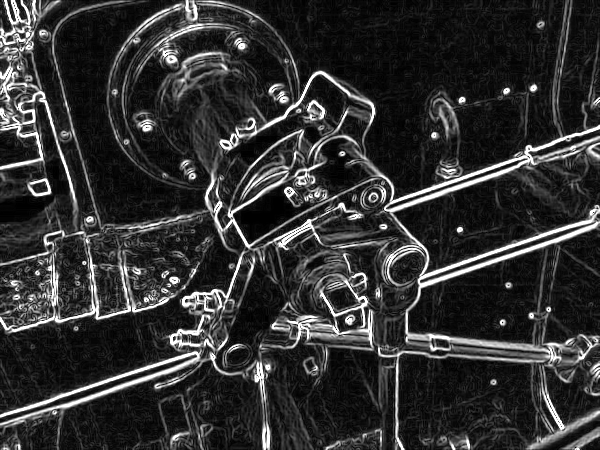
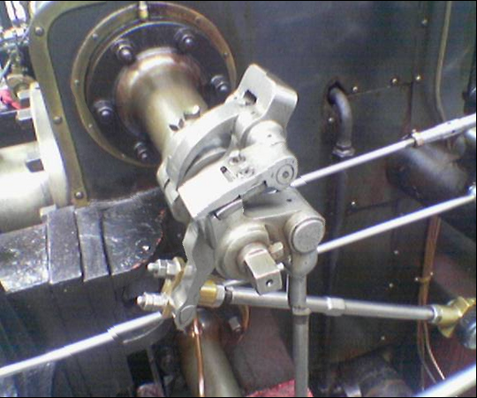
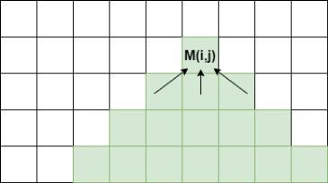
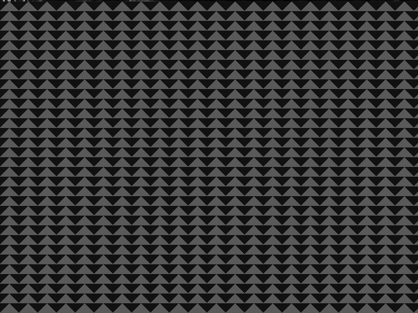
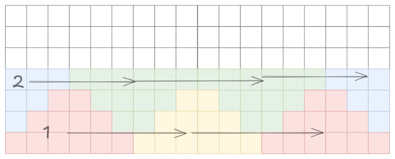
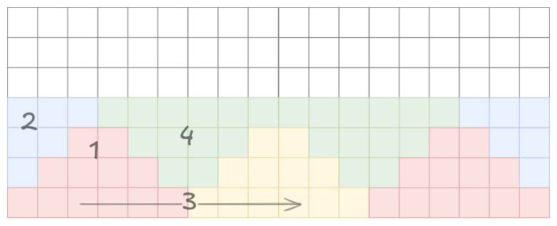

# Seam carving algorithm

Homework 01

- Enei Sluga
- Lan Vukušič

## Algorithm and task description

**Seam carving** is an algorithm for **content aweare image shrinking**.  
We have been tasked to parallelize the process using [OMP](https://www.openmp.org/).

Algorithm is divided into three sections of image manipulation and calculation:

- Energy calculation
  - Calculates the importance of image parts using a **sobel kernel** based edge detection
- Seam identifcation
  - Identification of lowest energy paths. Calculates the cumulative cost of all vertical paths so that they can be removed in the next step.
- Seam removal
  - Removes the pixels following the cheapest path and stiches the image back together

The steps are repeated `n` times, where `n` is the amount of pixels the image is shrinked for.

### Visual representation

Every steps mentioned is visualized on the provided example image [valve.png](./images/valve.png)  

**Base image**  
  

**Energy calculation using edge detection**  


**Cumulative energy visualized**  


**Final carved image**  


## Parallelization

The task was to optimize the process for parallel computation as much as possible using c++ framework **Open MP**.  

Each step of the process was parallelized using a different technique.

### Energy calculation

The first step was the easiest and most efficient to run in parallel.  
Each pixel can be calculated independently without with the only dependency being the original image.
This allowed us to use the so called **embarrasingly parallel** approach, where the `x` and `y` for loops were collapsed using `omp parallel for` directive.

```c++

#pragma omp parallel for collapse(2) schedule(dynamic)
  for (int x = 0; x < in.getWidth(); x++) {
    for (int y = 0; y < in.getHeight(); y++) {

```

This allows every thread to process its own pixel, which gives a theoretic maximum of $w * h$ threads to run in parallel.  

We believe that this is the best approach and gives no further space for improvements, due to its efficiency and simplicity of the task.

### Seam identification

This step was the most difficult to optimize.  
Seam identification computes the cheapest path from the pixel at `i,j` to the given pixel which depends on precalculated triangle _(green)_ below the pixel.  

  

This prevents us from using the same approach as before, where all dependencies were met at the beginning.  

A triangular division of work was used, as proposed by the exercise.  
The number of threads working on the task is nou bound by the **density of the triangular grid**. Examples of **2 triangles** and **22 triangles** per row are provided.  

**2 triangles**  
  

**22 triangles**  
  

Each thread computes one upward (ligh) triangle in a row, which satisfies all the dependencies for the downward (dark) triangles, which are again divided across the same amout of threads.  



OMP barrier is used inbetween two calculations to assure that all dependencies are met before computing the next batch of dark driangles.  

This is considered one **strip** that the whole image is divided into.
Processing of every strip is done sequentially since this is the only way to meet the dependecies for calculating pixels above the current strip.

There is a possible optimization, where a thread could start processing the down-facing triangles **as soon as nearest two upward-facing ones are complete**, but due to difficult implementation, this optimization is not included in the project.



### Seam removal

Seam removal is a process that is mostly copy-speed bound.  
The only optimization that we could do, was parallelizing the copying of every row, simmilarly to first task.  

We used the `#pragma omp parallel for` for optimizing the for loop over the vertical axis of the image.

```c++

  const int height = in.getHeight();
#pragma omp parallel for schedule(static)
  for (int y = 0; y < height; y++) {

```

## Results

We have timed the cumulative runtime along with the time it took for each section to complete.

