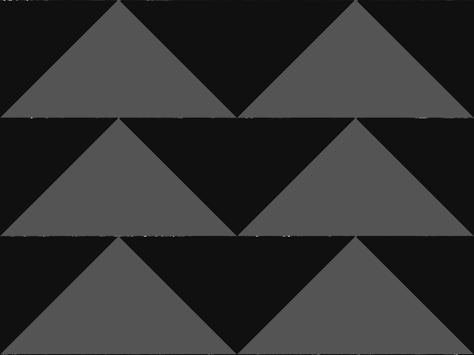

# Seam carving algorithm

Homework 01
- Enei Sluga
- Lan Vukušič

## Algorithm and task description

**Seam carving** is an algorithm for **content aweare image shrinking**.  
We have been tasked to parallelize the process using [OMP](https://www.openmp.org/).

Algorithm is divided into three sections of image manipulation and calculation:

- Energy calculation
  - Calculates the importance of image parts using a **sobel kernel** based edge detection
- Seam identifcation
  - Identification of lowest energy paths. Calculates the cumulative cost of all vertical paths so that they can be removed in the next step.
- Seam removal
  - Removes the pixels following the cheapest path and stiches the image back together

The steps are repeated `n` times, where `n` is the amount of pixels the image is shrinked for.

### Visual representation

Every steps mentioned is visualized on the provided example image [valve.png](./valve.png)  

**Base image**  
  

**Energy calculation using edge detection**  


**Cumulative energy visualized**  


**Final carved image**  


## Parallelization

The task was to optimize the process for parallel computation as much as possible using c++ framework **Open MP**.  

Each step of the process was parallelized using a different technique.

### Energy calculation

The first step was the easiest and most efficient to run in parallel.  
Each pixel can be calculated independently without with the only dependency being the original image.
This allowed us to use the so called **embarrasingly parallel** approach, where the `x` and `y` for loops were collapsed using `omp parallel for` directive.

```c++

#pragma omp parallel for collapse(2) schedule(dynamic)
  for (int x = 0; x < in.getWidth(); x++) {
    for (int y = 0; y < in.getHeight(); y++) {

```

This allows every thread to process its own pixel, which gives a theoretic maximum of $w * h$ threads to run in parallel.  

We believe that this is the best approach and gives no further space for improvements, due to its efficiency and simplicity of the task.

### Seam identification


### Seam removal

ENEI NAREDI TO PROSIM <3